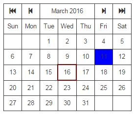

# Calendar Service

**A JavaScript service object used in Calendar widgets/components**

>Can be used with JavaScript frameworks (like AngularJs, ReactJs, etc) to create Calendar widgets (as shown below).

>

>Sample components that uses this service can be found at - [AngularJs](https://github.com/vijeysrc/calendar-service), [ReactJs](http://github.com) (work in progress)

## Features

1. Provides a matrix (Arrays of Arrays of Objects) data for a given date

2. Provides a series (Arrays of Objects) data for a given date

3. Has methods to move the window by month or by year.

4. For an AngularJs environment, it creates a factory service called CalendarService under the module vj.calendar.service
    - To get hold of the service, add the module vj.calendar.service to your app module.
    - ```vm.service = CalendarService.getInstance();```

## License

MIT
